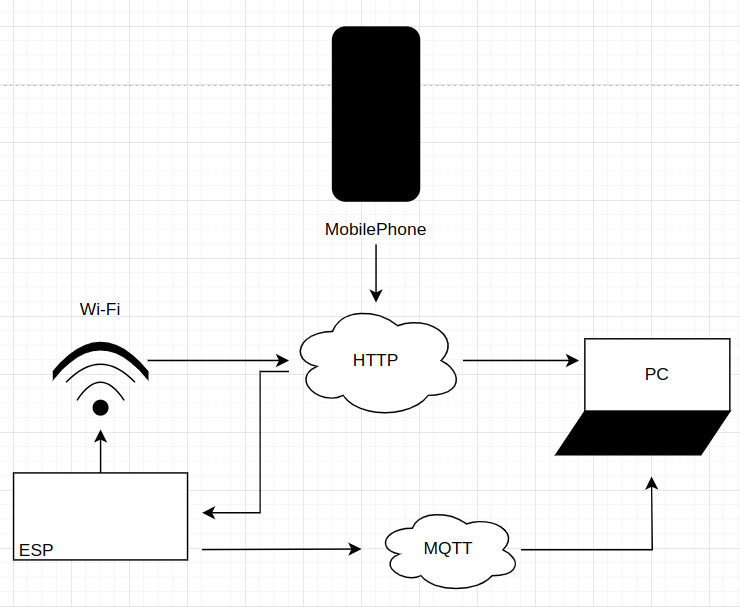

Данное приложение разработано для управления светодиода на ESP8266 при помощи mqtt, к которому подключается микросхема при помощи сайта и протокола http.

Ссылка на демонстрацию работы:

https://drive.google.com/file/d/15q4hTNjoGDMwiGYhyjeHoivRvsLzZf4D/view?usp=drivesdk
