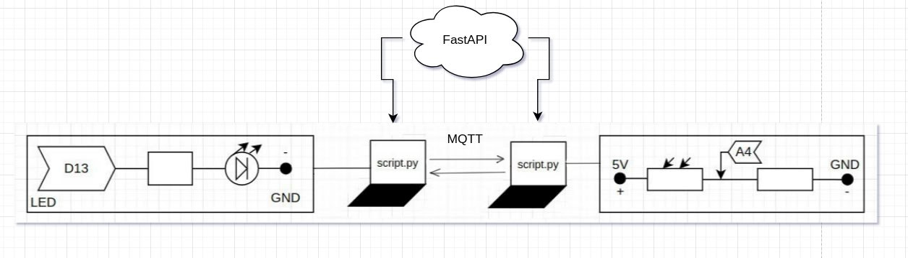

This application is designed to control two different microcontrollers from two computers. When enough light falls on the photosensitive sensor, the light on the other microcontroller begins to glow. Data transfer using mqtt is also implemented. ID issuance is done using FastAPI.

Link to demonstration of work:

https://drive.google.com/file/d/11z_1AY4HQ-d3r7wCyESbHl534SG3GE_1/view?usp=drivesdk

