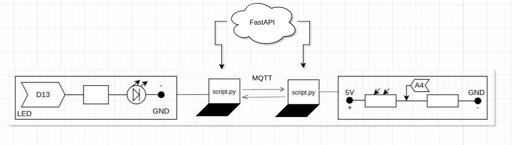

# MQTT
**The first board consists of:**
+ light sensor.
**The second board consists of:**
+ one LED.

Two boards: one board works with a light sensor, the other with an LED. The boards are connected to different laptops. Laptops communicate via MQTT.

**Demonstration of work:**
https://drive.google.com/file/d/1laJKBOXu-Ptr0yPrvH3jEWvxXInnjrLF/view?usp=drivesdk

