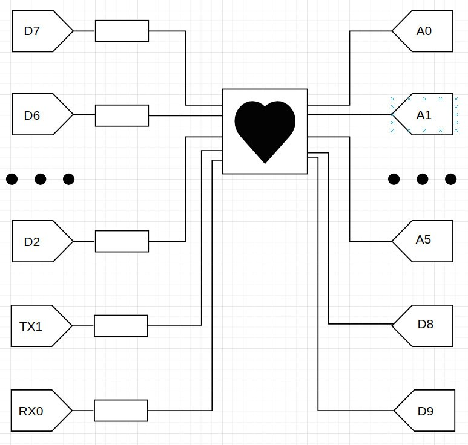

This application is made to display a heart image on an 8x8 LED matrix (1088AS) using registers.

Link to demonstration of work -
https://drive.google.com/file/d/1yOwVmAU8zbNjjFNHRdgnIxTrt6AAsQAR/view?usp=drivesdk

