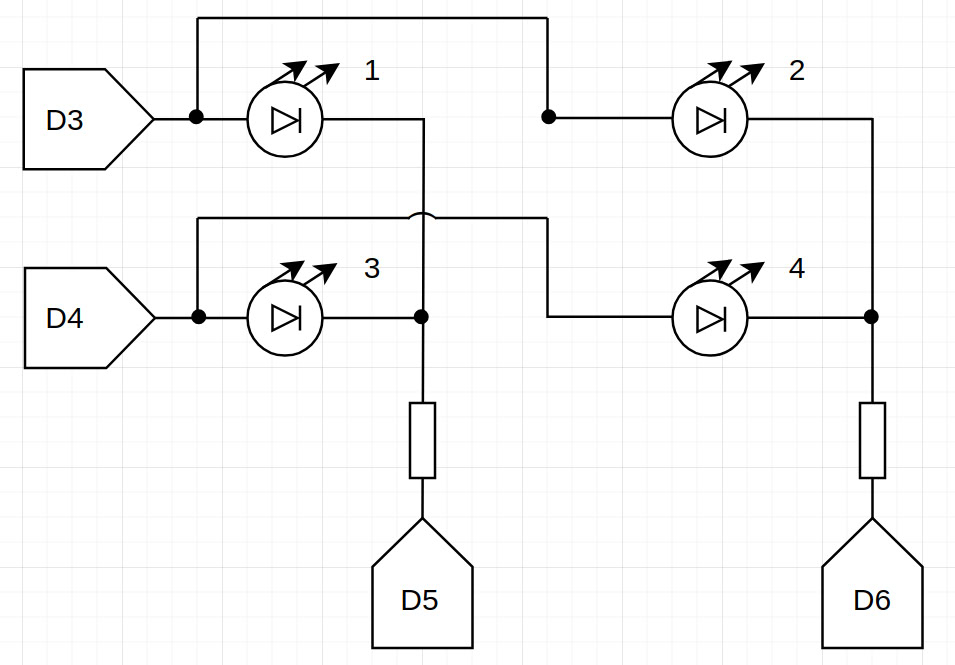

#LED Matrix

This project implements the operation of a LED matrix using 4 LEDs controlled by pulse width modulation (PWM).

**The LEDs switch in different modes:**

+ 0 0 0 0 0 0 0 0 - off;
+ 1 1 0 0 0 0 0 0 - on;
+ 1 0 0 1 0 0 0 0 - 1;
+ 1 0 1 0 0 0 0 0 - 2;
+ 0 1 0 1 0 0 0 0 - 3;
+ 0 1 1 0 0 0 0 0 - 4;
+ 1 0 0 0 0 0 0 0 - 1, 2;
+ 1 1 1 0 0 0 0 0 - 2, 4;
+ 0 1 0 0 0 0 0 0 - 3, 4;
+ 1 1 0 1 0 0 0 0 - 1, 3;
+ 1 0 0 1 0 1 1 0 - 1, 4;
+ 1 0 1 0 0 1 0 1 - 2, 3;
+ 1 0 0 0 0 1 0 1 - 1, 2, 3;
+ 1 0 0 0 0 1 1 0 - 1, 2, 4;
+ 1 1 0 1 0 1 1 0 - 1, 3, 4;
+ 1 0 1 0 0 1 0 0 - 2, 3, 4.

**Demonstration of work:** https://drive.google.com/file/d/1l12jgvl6B9EPMxaL2x5Kzg9eJ-dqpXsu

